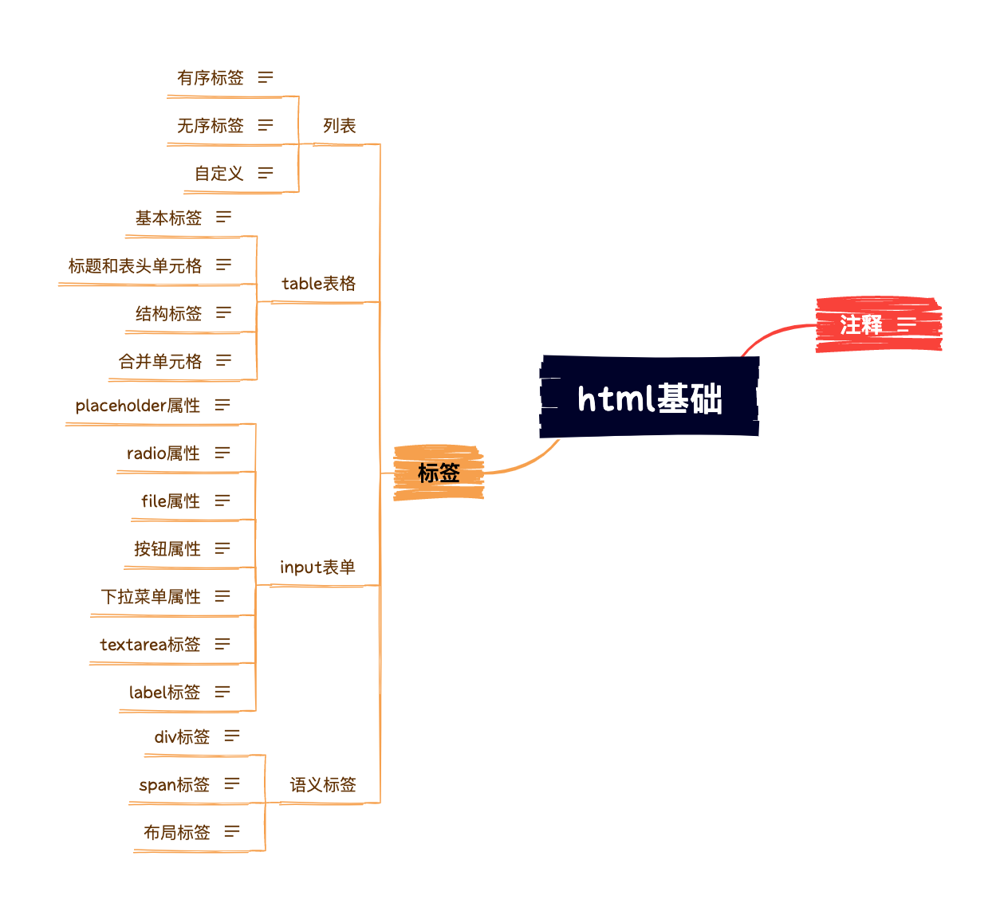

# 1. HTML5基础



#### 注释

```html
<!-- 注释内容 --!>

<!--
	注释内容
!-->
```

## 标签

### 列表

#### 有序标签

内容1 内容2 内容3

```html
 <ol>
	<li>内容1</li>
	<li>内容2</li>
	<li>内容3</li>
</ol>
```

#### 无序标签

无序标签 内容1 内容2 内容3 ... ul 标签只能包含li

```html
<ul>
	<li>内容1</li>
	<li>内容2</li>
	<li>内容3</li>
</ul>
```

*   自定义

    dd会自动锁进效果

    ```html
    <dl>
    	<dt>主题</dt>
    	<dd>内容1</dd>
    </dl>
    ```

### table表格

#### 基本标签

table > tr > td

```html
<table>
	<tr>
		<td>一行一列</td>
		<td>一行二列</td>
	</tr>
	<tr>
		<td>二行一列</td>
		<td>二行二列</td>
	</tr>
</table>
```

#### 标题和表头单元格

```html
<caption>表格大标题</caption>
<th>表头标签<th>
```

#### 结构标签

thread 表格头部 tbody 表格主体 tfoor 表格底部

#### 合并单元格

左上保留原则 rowspan 跨行合并 colspan 跨列合并 示例：

```html
<td rowspan="2">100</td>
```

### input表单

#### placeholder 输入框属性

```html
<input type="text" placeholder="请输入">
```

#### radio 单选框属性

单选框 type属性 "radio" name属性 分组 checked属性 默认值

```html
性别：<input type="radio" name="sex"> 男
	   <input type="radio" name="sex" checked> 女
```

#### file 上传文件属性

```html
单个文件
<input type="file">

多个文件
<input type="file" multiple>
```

#### submit / button / reset 按钮属性

提交按钮

```html
<input type="submit">
```

重置按钮

```html
<input type="reset">
```

需要在form标签下起作用

普通按钮

```html
 // <input type="button" value="按钮名称">
一般写<button type="submit">提交</button>
```

#### select 下拉菜单属性

select属性 option属性 下拉选择项 selected属性 默认下拉选择项

```html
<select>
	<option>选项1</option>
	<option>选项2</option>
	<option selected>选项3</option>
</select>
```

*   textarea标签

    cols：显示宽度 rows：显示行数

    注：默认右下角可以进行拖放，建议通过css进行样式调整

    ```html
    <textarea cols="60" rows="30"></textarea>
    ```
*   label标签

    点击文字也能进行选择，使用label标签将文字和单选框勾选在一起

    ```html
    性别：
    <input type="radio" name="sex" id="user"><label for="user">男</label>
    <label>
    	<input type="radio" name="sex">女
    </label>
    ```

### 语义标签

#### div标签

```html
一行只显示一个<div>
```

#### span标签

```html
一行显示多个span标签值
```

#### 布局标签

header nav footer aside section article
