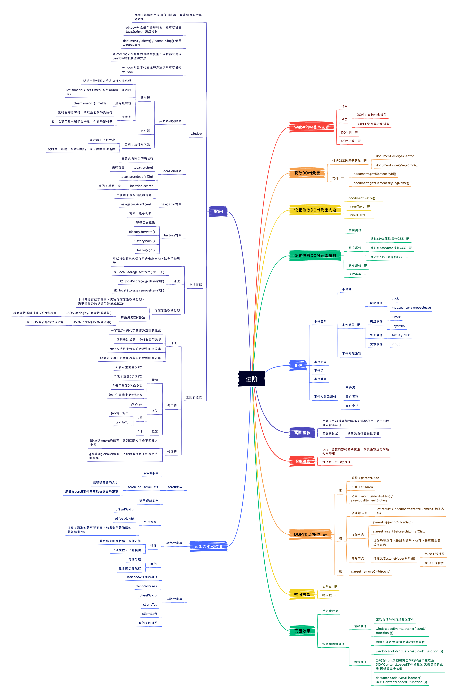

# 3.2 JavaScript WebAPI



## WebAPI

作用就是使用JS去操作html和浏览器 DOM：文档对象模型 BOM：浏览器对象模型

## DOM

### DOM树

将html文档以树状结构直观呈现，直接提现标签与标签之间的关系

### DOM对象

浏览器根据html标签生成的JS对象 所有标签属性都可以在这个对象上找到 修改这个对象的属性会自动映射到标签身上

### 获取DOM元素

根据CSS选择器获取 选择匹配的第一个元素 document.querySelector('css选择器')\
document.querySelector(' ul li:last-child') 返回多个元素 let lis = document.querySelectorAll('ul li') 得到的是一个伪数组，通过for遍历方法获得每一个对象 其他 //根据id获取第一个元素

### 设置修改DOM元素内容

*   document.write()

    只能追加到前面 包含的标签会被解析
*   .innerText

    将文本内容添加/更新到任意位置 不识别标签

    // 获取元素标签 let box = document.querySelector('div') // 修改标签元素内容 box是对象 innerText是属性 box.innerText = '有点意思～'
*   .innerHTML

    将文本内容添加/更新到任意位置 可以解析标签

    // 获取元素标签 let box = document.querySelector('div') // 修改标签元素内容 box是对象 innerHTML是属性 box.innerHTML = '\<strong>有点意思～\</strong>'

### 设置修改DOM元素属性

#### 常用属性

```javascript
   // 获取元素  
   let pic = document.querySelector(''img)  
   // 操作元素  
   pic.src = './images/b02.jpg'  
   pic.title = '这是一个图片'
```

#### 样式属性

**通过style属性操作CSS**

语法：对象.style.样式属性 = 值 如果样式有连接符，需要改成小驼峰

```javascript
   let box = document.querySelector('.box')
   box.style.backgroundColor = 'red'
```

**通过className操作CSS**

通过className操作CSS 语法：元素.className = 'css中class'

```javascript
        box.className = 'active'
```

会直接全部替换之前样式，要保留之前内容box.className = 'one active'

**通过classList操作CSS**

为了解决claassName容易覆盖之前类 通过classList进行追加或删除 // 追加一个类

* 元素.classList.add('类名') // 删除一个类
* 元素.classList.remove('类名') // 切换一个类
* 元素.classList.toggle('类名')

#### 表单属性

```javascript
	表单.value = '用户名' 表单.type = 'password'
```

**间歇函数**

开启定时器 setInterval(函数, 间隔时间) 作用每隔一段时间调用函数

清除定时器 clearInterval(timer)

### 事件

#### 事件监听

元素.addEventListener('事件', 执行的函数) 事件源：dom元素 事件：用什么方式出发 函数：要做什么

#### 事件类型

鼠标事件 点击：click 经过：mouseenter 离开：mouseleave 焦点事件 获得焦点：focus 失去焦点：blur 键盘事件 键盘按下：keydown 键盘抬起：keyup 文本事件 用户输入事件：input

#### 事件对象

#### 事件流

#### 事件委托

### DOM节点操作

DOM树里每一项内容 获取父节点：子元素.parentNode 获取子节点：父元素.children 数组

获取兄弟节点 获取下一个节点 元素.nextElementSibling. 获取上一个节点 元素.previousElementSibling.

增加节点 创建新的节点 - 将新的节点放入制定元素内部 document.createElement(‘标签名’) 父元素.appendChild(子元素)

### 时间对象

#### 实例化

代码中出现new 一般将这个操作称为实例化 创建一个时间对象并获取时间

#### 时间戳

时间戳 指从1970年1月1日0:0:0 到现在都毫秒数

获取时间戳 date.getTime() // 指定时间的时间戳 +new Date() / +new Date('2021-08-30 12:00:00') // 只能获取当前时间戳 Date.now()

#### 事件对象及属性

案例：图片跟随鼠标移动

```javascript

<script>
	let img = document.querySelector('img')
	document.addEventListener('mousemove', function (e) {
		//不断得到当前鼠标坐标
		//console.log(e.pageX)
		//console.log(e.pageY)
		//不断把鼠标坐标赋值给图片 left和top
		//img.Style.left = 100px 注意要带单位px
		img.Style.left = e.pageX + 'px'
		img.Style.top = e.pageY + 'px'
	})
</script>
```

### 事件捕获及事件冒泡

子节点在父节点中，点击 true: 使用捕获，从父到子 默认 false: 使用冒泡，从子到父

```javascript
<script>
	let fa = document.querySelector('.father')
	let son = document.querySelector('.son')
	fa.addEventListener('click', function(){
		alert('父节点')
	}, true)
	son.addEventListener('click', function(){
		alert('子节点')
	}, true)
</script>
```

#### 阻止事件流

默认为冒泡模式，子元素事件容易影响父级 使用 e.stopPropagation()

```javascript
<script>
	let fa = document.querySelector('.father')
	let son = document.querySelector('.son')
	fa.addEventListener('click', function(){
		alert('父节点')
	}, true)
	son.addEventListener('click', function(e){
		alert('子节点')
		// 阻止冒泡
		e.stopPropagation()
	}, true)
</script>
```

鼠标经过事件

* mouseover mouseout 有冒泡效果
* mouseenter mouseleave 没有冒泡效果 推荐！

#### 事件委托

给父级添加事件，将事件委托给父级

### 页面效果

案例：手风琴效果

```javascript
// 获取所有元素
let lis = document.querySelectorAll('li')
// 绑定鼠标经过和离开事件
for (let i=0; i < lis.length; i++) {
// 鼠标经过事件
	lis[i].addEventListener('mouseenter', function() {
	// 排他
		for (let j=0; j < lis.length; j++){
			lis[j].style.width = '100px'
		}
		this.style.width = '800px'
	}
// 鼠标移出事件
	lis[i].addEventListener('mouseleave', function() {
	// 排他
		for (let j=0; j < lis.length; j++){
			lis[j].style.width = '240px'
		}
	}
}
```

#### 滚动事件

```javascript
// 页面滚动事件
window.addEventListener('scroll', function() {
	//执行操作
})
```

#### scroll家族

scrollWidth / scrollHeight

```javascript
// 返回的是内容的高度 宽度
console.log(div.scrollWidth)
console.log(div.scrollHeight)
```

scrollTop

```javascript
// 返回的是被卷去的头部和左侧
console.log(div.scrollTop)
console.log(div.scrollLeft)

// 特别的针对页面滚动距离
let num = document.documentElement.scrollTop
console.log(num)
```

案例：返回顶部

```javascript
// 0. 获取元素
let backtop = document.querySelector('.backtop')
// 1. 页面滚动事件
window.addEventListener('scroll', function () {
	// 2. 页面检测滚动的距离
	let num = document.documentElement.scrollTop
	// 3. 进行显示判断
	if ( num >= 500 ) {
		// 显示返回顶部按钮
		backtop.style.display = 'block'
	} else {
		// 隐藏元素
		backtop.style.display = 'none'
	}
})

// 点击事件返回顶部
backtop.children[1].addEventListener('click', function(){
	document.documentElement.scrollTop = 0
})
```

#### Offset家族

获取宽高：offsetWidth offsetHeight

## BOM

Browser Object Model 浏览器对象模型

### window

window对象是个全局对象，也可以说是JavaScript中顶级对象 document / alert() / console.log() 都是window属性 通过var定义在全局作用域的变量、函数都会变成window对象属性和方法 window对象下的属性和方法调用可以省略window

#### 延时器和定时器

**延时器**

延迟一段时间之后才执行对应代码 语法： setTimeout(回调函数, 等待的毫秒数)

```javascript
let timer = setTimeout(回调函数, 等待的毫秒数)
clearTimeout(timer)
```

setInterval的特征是重复执行，首次执行时会延迟 setTimeout的特征是延时执行，只执行一次，也可以结合递归函数模拟setInterval重复执行 clearTimeout清除setTimeout创建的定时任务

#### js运行机制

JS是单线程，同一个时间只能做一件事

同步任务 异步任务 异步任务有以下三种类型：

1. 普通事件，如click、resize等
2. 资源加载，如load、error等
3. 定时器，如setInterval，setTimeout等

* 先执行执行栈中的同步任务
* 异步任务放入任务队列中
* 一旦执行栈中的所有同步任务执行完毕，系统按次序读取任务队列中的异步任务

#### location对象

主要负责网页的地址栏

```javascript
console.log(location.href) // 得到url地址
location.href = 'http://www.baidu.com'  // 利用js进行跳转页面
```

hash属性获取地址中的hash值，极符号#后面部分

```javascript
location.hash
```

用于vue路由的铺垫，经常用于不刷新页面，显示不同页面

#### navigator对象

主要用来获取浏览器信息

#### hisory对象

管理历史记录

#### swipe插件

www.swiper.com.cn
